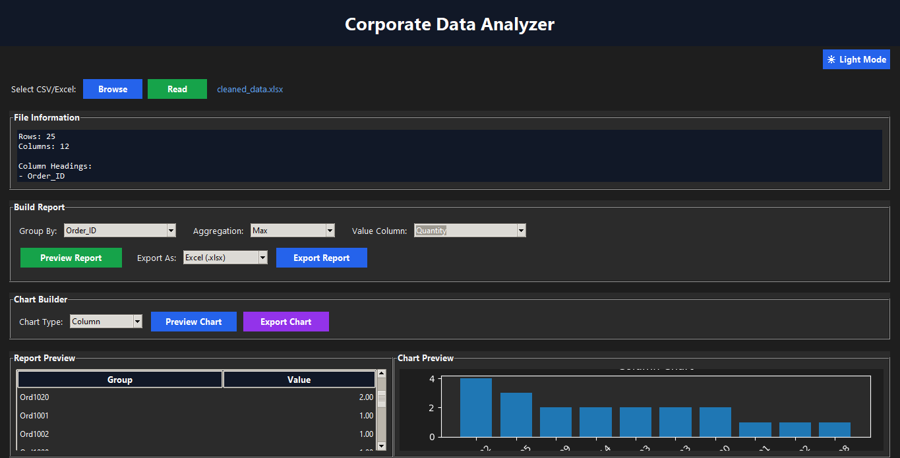
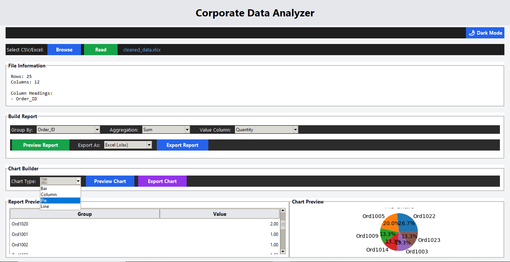

# Corporate Data Analyzer

A corporate-style desktop analytics application designed for non-technical users to analyze CSV and Excel data without writing code.

Corporate Data Analyzer is a professional desktop-based analytics application built using Python, Tkinter, Pandas, and Matplotlib.

## Key Functionalities

- Automatic dataset profiling
- Dynamic aggregation reporting
- Interactive chart generation
- Excel and CSV export
- Dark/Light mode support
- Standalone Windows executable deployment

## Technologies Used

- Python
- Tkinter
- Pandas
- Matplotlib
- OpenPyXL
- PyInstaller

## Project Type

Prompt Engineering with Python project focused on building a professional desktop analytics application for non-technical users.

## Development Approach

Developed using prompt engineering workflows to rapidly prototype and build a corporate-style desktop analytics application.

## End User Accessibility

The application is designed for non-technical users and can be used without any programming knowledge.

A standalone Windows executable (.exe) version of the application is also available, allowing users to run the software without installing Python or development tools.

## Connect

For executable access, collaboration, or project discussions, feel free to connect:

LinkedIn: https://www.linkedin.com/in/prem-sai-sanaka

---

# Application Screenshots

## Dark Mode

---

## Light Mode

